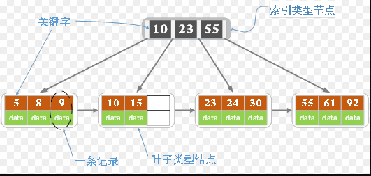

## B+树
### 一、为什么会有B+树
- 当我们需要遍历所有元素时，会有缺陷。我们知道树形结构结构的中序遍历可以实现
  顺序遍历（必须在内存中进行）。但是在B树的结构中，在进行中序遍历时必须往返于不同节点，
  但是这些不同的节点就位于不同的内存的空间扇页面上。我们很有可能经历节点1->节点3->节点5
  ->节点1->节点3->节点6。这是很糟糕的。

- B+树查询速度更稳定
- B+树天然具备排序功能

**可以理解成B+是B树的升级**
### 二、B+树的定义

各种资料上B+树的定义各有不同，一种定义方式是关键字个数和孩子结点个数相同。
这里我们采取维基百科上所定义的方式，即关键字个数比孩子结点个数小1，
这种方式是和B树基本等价的。上图就是一颗阶数为4的B+树。

除此之外B+树还有以下的要求。

1. B+树包含2种类型的结点：内部结点（也称索引结点）和叶子结点。
   根结点本身即可以是内部结点，也可以是叶子结点。
   根结点的关键字个数最少可以只有1个。
   
2. B+树与B树最大的不同是内部结点不保存数据，只用于索引，
   所有数据（或者说记录）都保存在叶子结点中。

3. m阶B+树表示了内部结点最多有m-1个关键字（或者说内部结点最多有m个子树），
   阶数m同时限制了叶子结点最多存储m-1个记录。
   
4. 内部结点中的key都按照从小到大的顺序排列，对于内部结点中的一个key，
   左树中的所有key都小于它，右子树中的key都大于等于它。
   叶子结点中的记录也按照key的大小排列。

5. 每个叶子结点都存有相邻叶子结点的指针，
   叶子结点本身依关键字的大小自小而大顺序链接。
   
### 三、插入操作
#### 规则
1. 若为空树，创建一个叶子结点，然后将记录插入其中，此时这个叶子结点也是根结点，
   插入操作结束。
   
2. 针对叶子类型结点：根据key值找到叶子结点，向这个叶子结点插入记录。
  插入后，若当前结点key的个数小于等于m-1，则插入结束。
  否则将这个叶子结点分裂成左右两个叶子结点，左叶子结点包含前m/2个记录，
  右结点包含剩下的记录，将第m/2+1个记录的key进位到父结点中
  （父结点一定是索引类型结点），进位到父结点的key左孩子指针向左结点,
  右孩子指针向右结点。将当前结点的指针指向父结点，然后执行第3步。
  
3. 针对索引类型结点：若当前结点key的个数小于等于m-1，则插入结束。
   否则，将这个索引类型结点分裂成两个索引结点，左索引结点包含前(m-1)/2个key，
   右结点包含m-(m-1)/2个key，将第m/2个key进位到父结点中，
   进位到父结点的key左孩子指向左结点, 进位到父结点的key右孩子指向右结点。
   将当前结点的指针指向父结点，然后重复第3步。
   
下面是一颗5阶B+树的插入过程，5阶B+树的结点最少2个key，最多4个key。

1. 空树中插入5

2. 

### 四、删除操作
### 五、特点
1. B+树的层级更少：相较于B树B+每个非叶子节点存储的关键字数更多，
   树的层级更少所以查询数据更快；

2. B+树查询速度更稳定：B+所有关键字数据地址都存在叶子节点上，
   所以每次查找的次数都相同所以查询速度要比B树更稳定;

3. B+树天然具备排序功能：B+树所有的叶子节点数据构成了一个有序链表，
   在查询大小区间的数据时候更方便，数据紧密性很高，缓存的命中率也会比B树高。

4. B+树全节点遍历更快：B+树遍历整棵树只需要遍历所有的叶子节点即可,
   而不需要像B树一样需要对每一层进行遍历，这有利于数据库做全表扫描。

**B树相对于B+树的优点是，如果经常访问的数据离根节点很近，
而B树的非叶子节点本身存有关键字其数据的地址，所以这种数据检索的时候会要比B+树快。**

### 六、